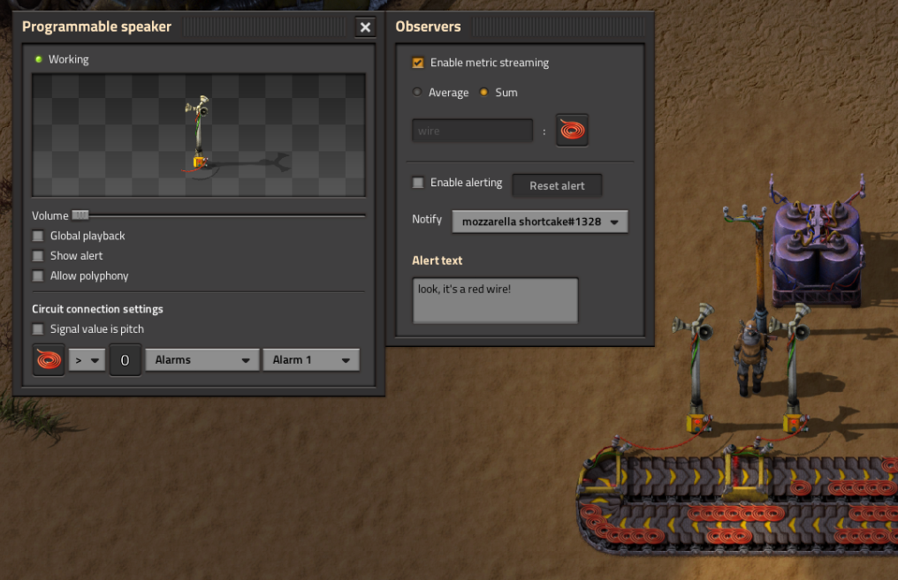
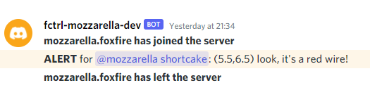

# fctrl - Observability

`fctrl - Observability` is a mod for Factorio that augments the programmable speaker to collect and export metrics and watch for alert conditions. Integration with [fctrl](https://github.com/circlesabound/fctrl) enables a full end-to-end telemetry solution for your factory, and allows you to monitor custom production statistics and be notified of events outside of the game.

## Features

- Transform any circuit value into a custom tagged metric
- Pre-aggregate metrics either as average/tick or sum
- Set up one-shot alerts fired on circuit conditions to ping users on Discord

## Integration with `fctrl`

This mod is designed to be used with [fctrl](https://github.com/circlesabound/fctrl), a Factorio server management solution. Statistics and alerts are exported from the game by writing to the process stdout, which `fctrl` captures for ingestion. Therefore, it is (basically) pointless to install this mod if you are not using `fctrl`.

Metrics ingested into `fctrl` can be accessed via the REST endpoint at `/api/v0/metrics`.

The alerting system makes use of `fctrl`'s Discord integration feature. If Discord integration is enabled, players can configure alerts in-game to mention users via a Discord message.

